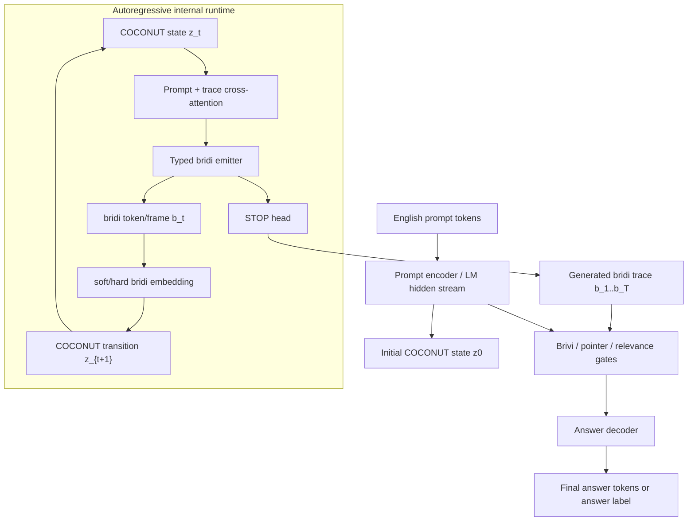
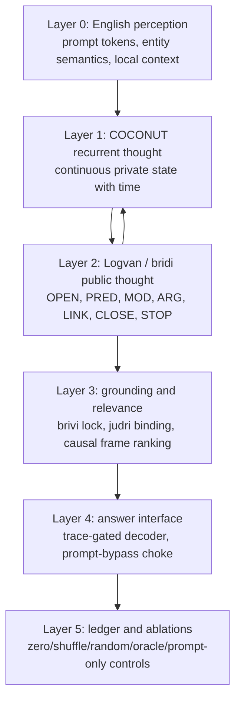
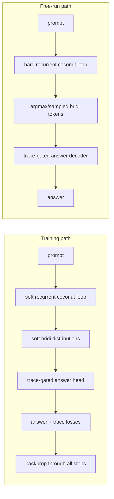
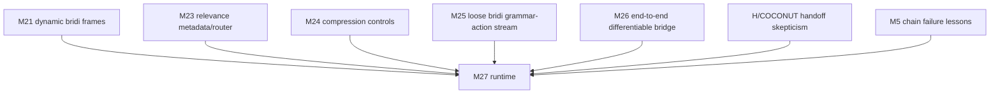

# M27 Coconut-Bridi Autoregressive Runtime

Status: design scaffold  
Branch target: `codex/m27-coconut-bridi-runtime-20260601`  
Parent control: `M26` full hidden-state bridge organism  

## 1. Thesis

M26 proved that the organs can be wired into one differentiable PyTorch organism:

- prompt hidden-state stream
- bridi/loose-stream generator
- soft differentiable trace handoff
- trace-language bridge
- answer loss reaching language backbone, generator, symbol heads, advisor, and bridge

M26 did not prove that the system can think autoregressively in an internal language.

M27 tests the missing claim:

> A model can run a recurrent COCONUT latent thought state, project each thought step into a typed bridi token/frame stream, feed that emitted internal language back into the next thought step, stop itself, and answer through a causally necessary trace.

Short version:

```text
COCONUT gives time.
Bridi gives grammar.
The bridge/gate gives causal necessity.
```

## 2. Non-Negotiable Design Boundary

M27 is not allowed to be:

- a parallel slot emitter pretending to be a chain
- a trace reconstruction classifier pretending to be a chatbot
- a raw prompt classifier with a decorative symbolic sidecar
- a latent handoff that bypasses the bridi surface
- a hard symbolic argmax path during training that silently cuts gradients
- an English CoT generator wearing Lojban labels

M27 must have both modes:

- soft differentiable training mode
- hard autoregressive free-run inference mode

If only the soft mode works, M27 is not a real runtime yet.

## 3. Whole-System Diagram



### 3.1 Layered Logvan Stack



The system is not "a chatbot plus a sidecar." It is a stack where every layer has a falsifiable job:

- English perception carries entity semantics.
- COCONUT carries recurrent latent time.
- Logvan/bridi carries typed public internal language.
- Grounding/relevance prevents floating predicates and decoy-frame reads.
- The answer interface proves the internal trace can drive output.
- The ledger proves the trace survives corruption controls.

## 4. One Runtime Step

At step `t`:

```text
inputs:
  prompt_hidden_states H
  prompt_mask M
  previous coconut state z_{t-1}
  previous emitted bridi token/frame b_{t-1}
  accumulated bridi memory B_{<t}

compute:
  c_t = cross_attention(query=z_{t-1}, keys=H + B_{<t})
  z_t = coconut_cell(z_{t-1}, c_t, embed(b_{t-1}))
  logits_t = bridi_emitter(z_t, c_t)
  b_t_soft = differentiable distribution over typed bridi vocabulary
  b_t_hard = argmax/sample only for free-run inference
  stop_t = stop_head(z_t)
```

Training uses `b_t_soft` so answer loss can backpropagate through the whole chain.

Inference uses `b_t_hard` and loops until `STOP` or `max_steps`.

## 5. Runtime State Types

### 5.1 COCONUT State

The COCONUT state is the private continuous thought state.

```text
z_t: [batch, hidden_dim]
```

It may:

- attend to prompt hidden states
- attend to prior bridi emissions
- update recurrently
- generate the next bridi token/frame

It may not:

- directly feed the answer decoder as an unrestricted bypass
- carry ungrounded answer information into the final head
- be treated as success without bridi ablations

### 5.1.1 COCONUT Reuse Policy

Legacy COCONUT/KV handoff should be treated as a warning label, not a plug-in.

Reuse:

- recurrent latent compute
- virtual-token/runway telemetry
- bridge activation metrics
- hidden-state shock/shape checks
- gradient-flow and adapter-disabled safety tests

Do not reuse:

- raw KV handoff as the answer path
- unbounded residual injection into an English decoder
- cosine/geometry retention as a success metric
- direct `z_T -> answer` classifiers

M27's COCONUT state exists to give the internal language time to unfold. It does not get to smuggle the final answer around the bridi trace.

### 5.2 Bridi Surface

The bridi surface is the public internal language.

M25 gives a useful loose grammar-action stream:

```text
OPEN
PRED(gismu_id)
MOD(cmavo_id)
ARG(entity_or_judri_id, place_id)
LINK
CLOSE
STOP
```

M27 should keep this typed stream, but make it autoregressive:

```text
b_1 = OPEN(frame=1)
b_2 = PRED(size)
b_3 = MOD(excess)
b_4 = ARG(entity=1, place=1)
b_5 = CLOSE(frame=1)
b_6 = STOP
```

### 5.3 Bridi Memory

The emitted bridi sequence becomes memory for future steps:

```text
B_t = concat(B_{t-1}, embed(b_t))
```

Later steps must condition on earlier emitted steps. This is the missing distinction between M26 and a real internal runtime.

## 6. Training vs Inference



Acceptance requires both:

- soft training metrics are good
- hard free-run metrics remain good enough that the trace is not just a training-time fantasy

## 7. Core Losses

Keep the loss surface small. Past failures repeatedly show that piles of adversarial losses produce collapse or noise.

### 7.1 Trace Teacher Loss

Supervise bridi token/frame emission on synthetic assay rows:

```text
L_trace = CE(type_t) + CE(value_t) + CE(aux_t) + BCE(active_t) + CE(stop_t)
```

This is a scaffold, not the final scientific evidence.

### 7.2 Answer Loss

The final answer must be solved through the generated trace:

```text
L_answer = CE(answer_logits, target)
```

This is the main task loss.

### 7.3 Causal Trace Necessity Loss

Full trace must outperform damaged traces:

```text
L_necessity = max(0, margin + L_answer(full_trace) - L_answer(ablated_trace))
```

Ablations:

- zero trace
- shuffled trace
- random trace
- no-judri trace
- no-cmavo trace
- decoy-only trace

This inherits the M19/M21 pointer necessity lesson but applies it to the autoregressive trace.

### 7.4 Relevance Rank Loss

M23 showed decoy relations are a real failure surface. If multiple frames exist, answer-causal frames must outrank decoys:

```text
L_relevance = max(0, margin - score(relevant_frame) + score(decoy_frame))
```

No broad new regularizer. This is local to frame selection.

### 7.5 MDL / Trace Budget

M24/M25 taught that compression must be first-class:

```text
L_mdl = mean(trace_length)
```

But it must stay small. It is a rate-distortion pressure, not a semantic tax. Decorative anti-PAD penalties are forbidden.

### 7.6 Total

```text
L = w_trace L_trace
  + w_answer L_answer
  + w_necessity L_necessity
  + w_relevance L_relevance
  + w_mdl L_mdl
```

Default starting point:

```text
w_trace = 1.0
w_answer = 1.0
w_necessity = 0.5
w_relevance = 0.2
w_mdl = 0.01
```

The first ablation grid should test the presence/absence of each term before tuning weights.

## 8. Anti-Bypass Rules

M27 only matters if the trace is causal.

### 8.1 No Floating COCONUT Answer Path

The answer decoder may not read raw `z_T` unless that state is explicitly gated by grounded bridi emissions.

Allowed:

```text
answer_state = bridge(prompt_hidden, bridi_memory, bridi_grounding_gates)
```

Forbidden:

```text
answer_state = MLP(z_T)
```

That would recreate a hidden-state classifier.

### 8.2 Brivi Lock

Predicate energy is silent unless grounded by arguments:

```text
predicate_energy_t *= grounding_mass(ARG/JUDRI tokens for that frame)
```

This keeps a floating `PRED(size_excess)` from solving the task without binding to an entity.

### 8.3 Prompt Bypass Choke

The final answer head cannot solve from raw prompt state alone.

Controls:

- prompt-only matched token budget
- answer from trace only
- answer from prompt only
- answer from trace-conditioned residual

Promotion requires trace-conditioned full path to beat matched prompt-only or at least expose a clear token-efficiency tradeoff.

### 8.4 Hard Free-Run Gap

Always report:

```text
soft_teacher_forced_accuracy
hard_free_run_accuracy
soft_hard_gap
```

A large gap means the differentiable path is lying.

### 8.5 Side-Channel Kill Tests

M6 exposed the "Morse Code" cheat: a model can encode the answer in trace length, STOP position, token presence, or gate activation rather than in meaningful bridi content.

M27 must therefore test:

```text
constant_length_trace_accuracy
constant_stop_position_accuracy
type_only_trace_accuracy
value_only_trace_accuracy
permuted_value_trace_accuracy
gate_presence_only_accuracy
trace_length_answer_mutual_information
stop_position_answer_mutual_information
```

Promotion requires these side channels to be weaker than the full typed trace path.

### 8.6 Gate Liveness

H5 taught that a gate that never fires is fake architecture.

Every gate must report both liveness and causal effect:

```text
brivi_gate_active_rate
brivi_gate_silence_rate_on_floating_predicates
relevance_gate_entropy
relevance_oracle_delta
grounding_gate_mean
grounding_gate_ablation_delta
```

Unused machinery counts against the cell, even if headline accuracy is high.

## 9. What Prior Experiments Force Us To Remember

The hundreds of experiments do not need to be mentally replayed line by line. They need to become design constraints.

| Lineage | Lesson | M27 constraint |
|---|---|---|
| A-G / H | Raw latent/KV handoff and projected handoff were fragile and often non-competitive. | Do not treat hidden handoff as evidence. Force trace ablations and free-run evaluation. |
| J / M1 | Data invariance and foil discipline matter before architecture claims. | Use minimal pairs, counterfactual groups, entity renames, and foils from day one. |
| L / M2 | Identity, arity, and scope constraints prevent semantic smuggling. | Bridi tokens need typed roles and grounding gates; no noun-stuffing into predicates. |
| M3 | Bridge exposure can corrupt English continuation or become decorative. | Bridge must be choked, measurable, and ablated. |
| M4 | Predicate grounding has to be tested directly. | Trace tokens must support semantic probes and causal swaps. |
| M5 | Autoregressive chain formats can become empty/decorative without answer necessity. | Every generated step needs downstream causal utility tests. |
| M11 | Discriminative readout can prove signal exists but is not a generative runtime. | Do not promote classifier-only success as chatbot success. |
| M14 | Scratchpad/re-entry can bleed or collapse without strict controls. | Report contamination, shuffled/random trace controls, and prompt bypass metrics. |
| M18/M19 | Surface robustness, seed stability, token efficiency, and strict accuracy must be canonical. | Six-seed runs, kill surfaces, strict accuracy, avg tokens, accuracy/token. |
| M20 | Dictionary-first synthetic success can be too clean. | Keep dictionary/trace tests but require OOD and decoy surfaces. |
| M21 | Dynamic bridi traces are learnable and nearly exact, but causality must be proven. | Reuse gismu/cmavo/judri traces; keep judri and cmavo ablations. |
| M22 | More surface diversity helps expose brittleness; geometry tricks are not primary fixes. | Add semantic coverage, not new manifold cleverness first. |
| M23 | Decoy relations break naive trace readers; relevance selection matters. | Include relevance router/ablations in M27, not as a later patch. |
| M24 | Compression is part of the thesis, not a leaderboard side metric. | Report trace tokens, answer tokens, compression ratio, accuracy per trace token. |
| M25 | Loose bridi grammar is a better surface than rigid rows, but it was still parallel. | Reuse loose grammar tokens and make them autoregressive. |
| M26 | End-to-end differentiability is now real, but the internal language is not causal-time. | Keep soft handoff and gradient probes; replace parallel emission with recurrent decoding. |

## 10. Component Reuse Map



Reusable pieces:

- `BridiFrame`, gismu/cmavo/judri vocabulary from M21
- relevance metadata from M23
- token accounting and prompt-only matched controls from M24
- loose grammar-action stream from M25
- soft differentiable handoff and gradient probes from M26
- COCONUT latent recurrent idea from legacy H/M3/M5 lines

Missing pieces:

- recurrent coconut cell
- autoregressive bridi decoder
- hard free-run bridi generation
- causal answer decoder over generated trace
- soft/hard consistency metrics
- step dependency probes

### 10.1 Organ Inventory

| Organ | Source | M27 use | Caveat |
|---|---|---|---|
| Dynamic bridi schema | M21 `BridiFrame`, `DynamicBridiExample` | typed frame semantics and targets | current synthetic world is still small |
| Judri/brivi gates | M21 losses/metrics | grounding invariants | should be extracted into reusable helpers |
| Relevance masks/router | M23 | decoy-frame OOD control | current surfaces are narrow |
| Packed hard trace controls | M24 | shuffled/random/zero/oracle baselines | not differentiable, control only |
| Loose grammar stream | M25 | public Logvan token/action vocabulary | currently parallel, must become autoregressive |
| Prompt-only matched controls | M24/M25/M26 | fair baseline and token accounting | duplicated helpers should be centralized |
| Differentiable soft trace advisor | M26 | soft training bridge | prefix budget is primitive |
| Trace-language bridge | M26 | answer path starting point | needs stronger bypass tests |
| Gradient probes | M26 | promotion gates | need seed/statistical confidence |
| COCONUT handoff telemetry | H/M3 | recurrent-state diagnostics | do not reuse raw hidden handoff as success |

## 11. M27 Module Contract

### 11.1 `M27CoconutBridiRuntime`

Expected PyTorch shape:

```python
class M27CoconutBridiRuntime(nn.Module):
    def forward(
        self,
        input_ids: torch.Tensor,
        *,
        teacher_trace: torch.Tensor | None = None,
        mode: Literal["soft_train", "hard_free_run"] = "soft_train",
        max_steps: int | None = None,
    ) -> dict[str, torch.Tensor]:
        ...
```

Must return:

```text
answer_logits
trace_type_logits
trace_value_logits
trace_aux_logits
trace_active_logits
stop_logits
soft_trace_embeddings
hard_trace_tokens
coconut_states
step_attention
frame_relevance_logits
grounding_gate_values
```

### 11.2 `CoconutRecurrentCell`

```python
z_t = cell(
    previous_state=z_prev,
    prompt_context=prompt_ctx_t,
    previous_bridi_embedding=b_prev,
    trace_context=trace_ctx_t,
)
```

Candidate implementations:

- GRU-style gated recurrent cell
- small transformer decoder block over latent steps
- state-space style recurrent block later, only if GRU/decoder baseline fails

Start boring. Do not begin with exotic geometry.

### 11.3 `AutoregressiveBridiEmitter`

Emits one typed loose-bridi symbol per step:

```text
type_id in [PAD, OPEN, PRED, MOD, ARG, LINK, CLOSE, STOP]
value_id depends on type
aux_id depends on type/place/frame
```

Training uses teacher forcing or scheduled sampling.

Evaluation uses hard autoregressive decoding.

### 11.4 `Trace-Gated Answer Decoder`

Reads:

- prompt hidden states as keys/values for grounding
- bridi memory as causal trace
- relevance/grounding gates

Does not read:

- unrestricted final coconut state as answer state
- raw prompt pooled state as answer state

## 12. Required Ablation Grid

### 12.1 Architecture Cells

| Cell | Description |
|---|---|
| M27.A | soft teacher-forced autoregressive bridi loop |
| M27.B | hard free-run bridi loop |
| M27.C | COCONUT recurrence enabled vs feed-forward step decoder |
| M27.D | brivi/grounding gate enabled |
| M27.E | relevance router enabled |
| M27.F | trace-gated answer decoder with prompt bypass choke |
| M27.G | full combined runtime |

### 12.2 Negative Controls

| Control | Expected result |
|---|---|
| zero trace | accuracy drops |
| shuffled trace | accuracy drops |
| random trace | accuracy drops |
| no-cmavo | cmavo-critical surfaces drop |
| no-judri | role-binding surfaces drop |
| decoy-only | decoy OOD drops |
| no-recurrence | multi-step tasks drop |
| prompt-only matched budget | should be competitive baseline, not ignored |
| oracle trace | upper bound |

### 12.3 Promotion Gates

M27 can only be called a real runtime if:

```text
answer_loss_reaches_prompt_encoder = 1
answer_loss_reaches_coconut_cell = 1
answer_loss_reaches_bridi_emitter = 1
answer_loss_reaches_trace_bridge = 1
hard_argmax_training_cut_detected = 0
hard_free_run_accuracy > zero_trace_accuracy + margin
hard_free_run_accuracy > shuffled_trace_accuracy + margin
hard_free_run_accuracy > random_trace_accuracy + margin
multi_step_accuracy > no_recurrence_accuracy + margin
soft_hard_gap <= tolerance
trace_token_count < matched_prompt_token_count
```

### 12.4 Required Metrics

Primary:

```text
hard_free_run_strict_accuracy
soft_teacher_forced_strict_accuracy
soft_hard_gap
multi_step_strict_accuracy
trace_exact_accuracy
predicted_vs_zero_delta
predicted_vs_shuffled_delta
predicted_vs_random_delta
predicted_vs_prompt_only_delta
accuracy_per_trace_token
```

Guardrails:

```text
answer_loss_reaches_coconut_cell
answer_loss_reaches_bridi_emitter
answer_loss_reaches_trace_bridge
raw_prompt_bypass_blocked
hard_argmax_training_cut_detected
brivi_gate_active_rate
side_channel_mutual_information_max
trace_length_mean
stop_accuracy
loop_rate
seed_stability_rate
```

Diagnostics:

```text
op_entropy
top1_op_share
active_predicate_count
cmavo_accuracy
judri_binding_accuracy
relevance_top1_accuracy
oracle_trace_accuracy
oracle_relevance_accuracy
no_recurrence_accuracy
```

## 13. Data Curriculum

Do not start with open-domain chat.

Start with controlled tasks:

1. single-frame semantic tasks
2. cmavo-critical polarity/negation/comparison tasks
3. judri-critical role-binding tasks
4. decoy relation OOD tasks
5. two-step causal chains
6. three-to-five-step state tracking tasks
7. prompt-only matched-budget comparisons
8. small actual bridge eval only after hard free-run works

The goal is not to win a chatbot benchmark first. The goal is to prove internal language causality.

## 14. Implementation Sequence

### Step 1: Skeleton

- add `src/lojban_evolution/m27/`
- add `scripts/m27/run_m27_coconut_bridi_runtime.py`
- add `tests/test_m27_coconut_bridi_runtime.py`
- add family registry and direct unified eval hooks

### Step 2: Teacher-Forced Runtime

- prompt encoder
- coconut recurrent cell
- typed autoregressive bridi emitter
- trace teacher loss
- answer head through soft trace
- gradient probes

### Step 3: Hard Free-Run

- argmax/sampling loop
- STOP termination
- pack decoded trace
- soft/hard gap metrics

### Step 4: Causal Necessity

- zero/shuffle/random/no-cmavo/no-judri/decoy-only controls
- necessity hinge
- brivi grounding gate
- relevance router

### Step 5: Ledger Integration

- taxonomy entry
- ablation test matrix entry
- direct unified eval support
- whole-grid row
- Airflow DAG

### Step 6: Scaling

- six seeds
- longer chains
- larger train/eval sizes
- matched prompt-only baselines
- token-efficiency report

## 15. What We Are Actually Designing

We are designing a learned latent-language interpreter.

It has:

- an English perception system
- a recurrent continuous thought state
- a typed compact internal language
- a causal bridge from internal language to answer
- a free-run runtime
- a ledger proving the trace matters

This is not yet "best chatbot." It is the first architecture that can honestly test the Sapir-Whorf-style claim:

> Does forcing thought through a compact, unambiguous, learned Lojbanic substrate improve reasoning/compression in a way that survives ablation?

If M27 passes, then the next family can attach a real text-generating decoder.

If M27 fails, the result is still valuable: it tells us that the learned bridi substrate can be reconstructed and used in classifiers, but not yet run as an internal causal language.

## 16. Falsification Conditions

M27 should be easy to kill if it is fake.

The architecture fails the thesis if any of these are true:

- hard free-run collapses while teacher-forced soft mode succeeds
- zero/shuffled/random traces do not hurt
- matched prompt-only beats the trace path at the same or lower token budget
- no-recurrence matches recurrent COCONUT on multi-step tasks
- side-channel controls recover the answer from length, STOP position, or gate presence
- answer loss does not reach the coconut cell and bridi emitter
- gates are alive but ablation-insensitive
- trace exactness rises while causal deltas stay near zero
- prompt/entity renames break the trace

This is important. We are not trying to protect M27 from failure. We are trying to make failure informative.

## 17. First Build Decision

Start from M26, not from M21.

Reason:

- M26 already has one optimizer, differentiable soft trace handoff, prompt hidden states, bridge, answer loss, and gradient probes.
- M25 supplies the loose grammar-action vocabulary.
- M21/M23 supply constraints and labels.
- M24/M25 supply hard symbolic controls.
- Legacy COCONUT supplies the recurrent-time idea and telemetry warnings.

The first implementation should be boring:

```text
M26 prompt encoder
+ GRU-style CoconutRecurrentCell
+ one-symbol-per-step AutoregressiveBridiEmitter
+ M26 soft trace advisor/bridge
+ M24/M25 corruption controls
+ M26 gradient probes
```

Only after that works should we try:

- larger host LLM adapter
- text-generating answer decoder
- more open semantic surfaces
- richer learned Logvan grammar
